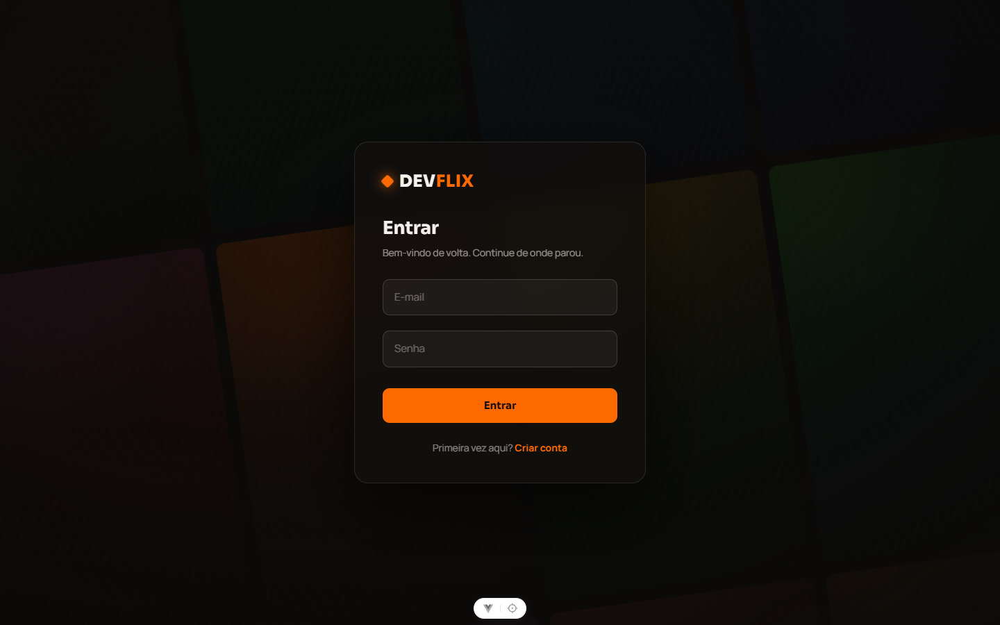
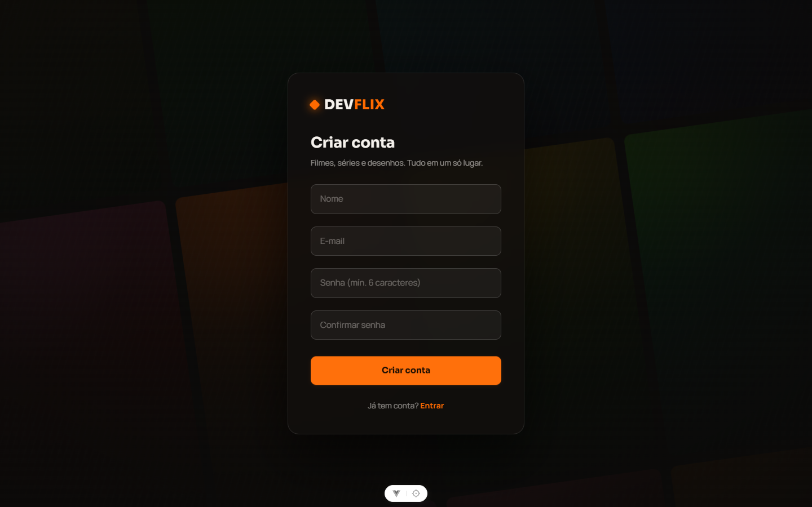
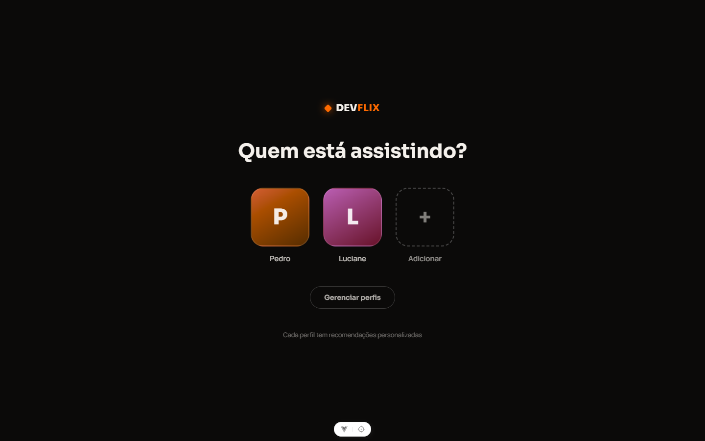
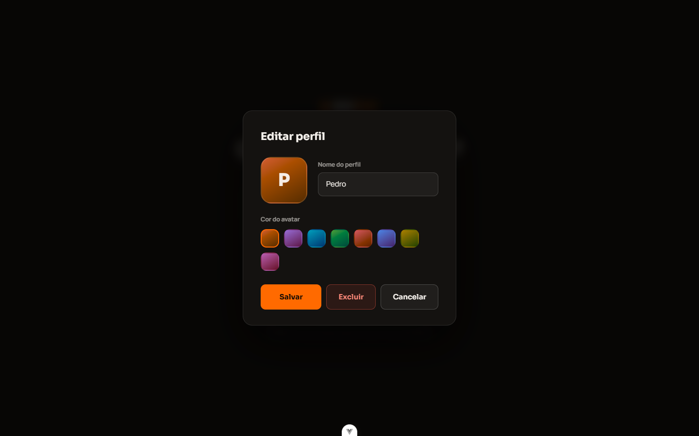
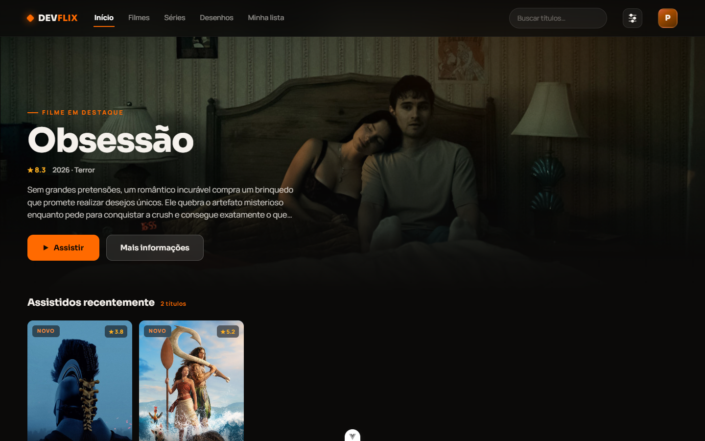
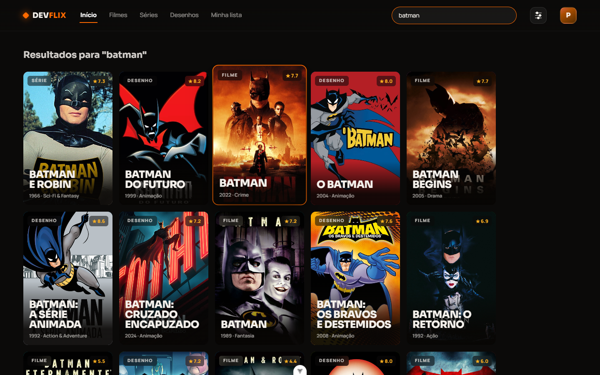
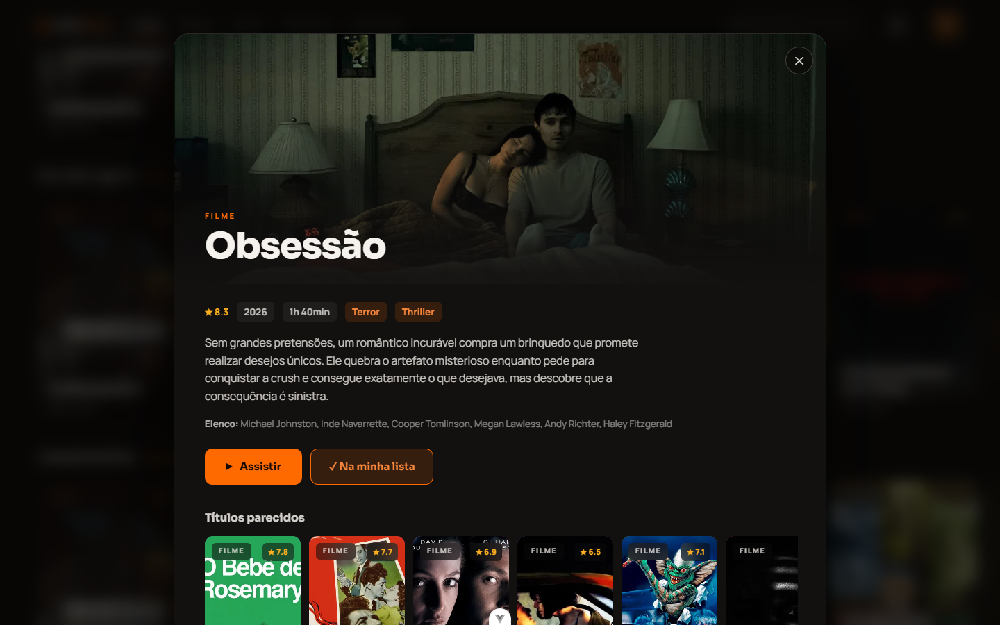
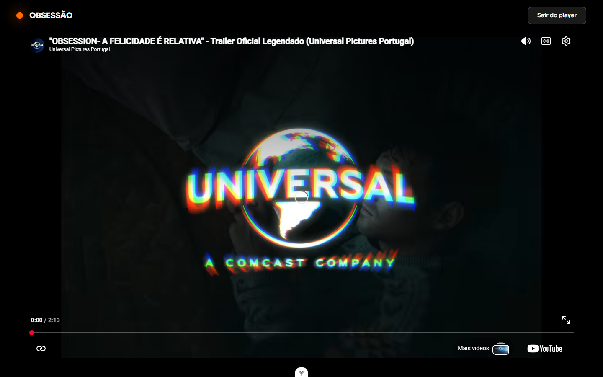
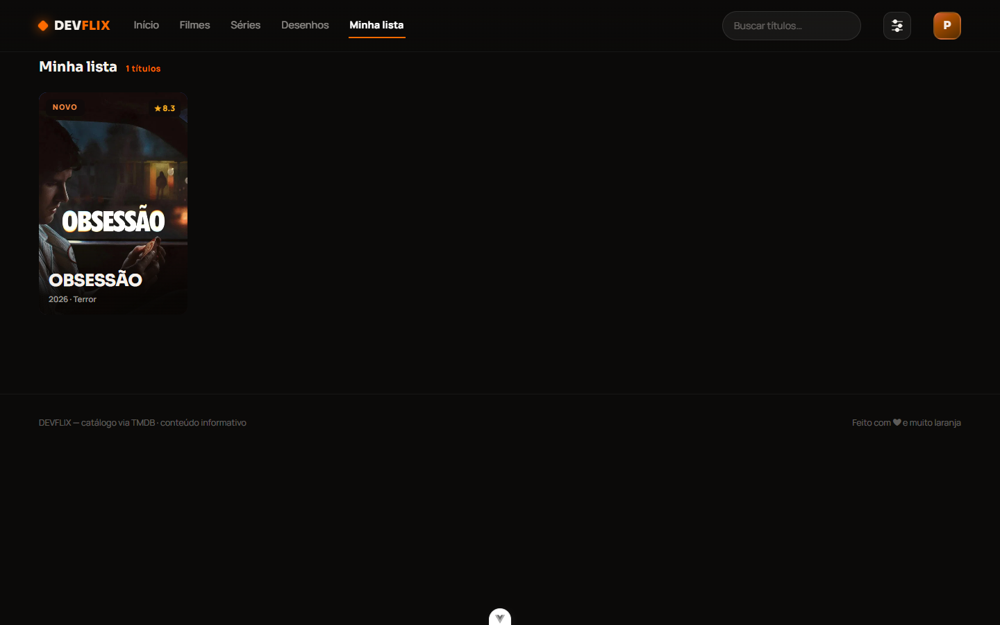
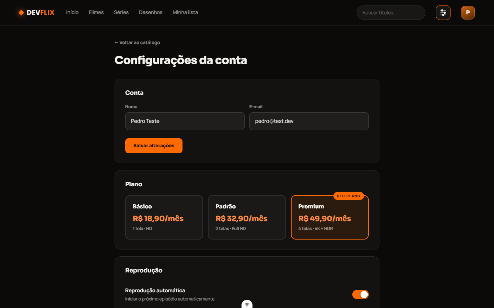

# DevFlix

Plataforma de streaming construída com **Vue 3 + Pinia + Tailwind** no frontend e **NestJS + Prisma + PostgreSQL** no backend, com catálogo alimentado pela API do [TMDB](https://developer.themoviedb.org/).

## Demonstração


> 🎬 Versão em vídeo: [docs/demo.mp4](docs/demo.mp4)

## Telas

| Login                                | Cadastro                                   |
| ------------------------------------ | ------------------------------------------ |
|  |  |

| Seleção de perfis                        | Editor de perfil                                         |
| ---------------------------------------- | -------------------------------------------------------- |
|  |  |

| Catálogo                               | Busca                                 |
| -------------------------------------- | ------------------------------------- |
|  |  |

| Detalhe do título                                       | Player de trailer                      |
| ------------------------------------------------------- | -------------------------------------- |
|  |  |

| Minha lista                                  | Configurações da conta                          |
| -------------------------------------------- | ----------------------------------------------- |
|  |  |

## Estrutura

```
streaming/
├─ client/   # Vue 3 + Vite + TypeScript + Pinia + Tailwind
├─ server/   # NestJS + Prisma + PostgreSQL + JWT
└─ docker-compose.yml
```

## Funcionalidades

- Autenticação com JWT (access token + refresh token com rotação em cookie httpOnly)
- Múltiplos perfis por conta (até 5), com avatar personalizável
- Catálogo de filmes, séries e desenhos via TMDB (proxy no backend, chave nunca exposta)
- Hero rotativo, linhas de catálogo, busca em tempo real
- Detalhe do título com temporadas, episódios e títulos parecidos
- Player de trailer (YouTube)
- Minha lista e histórico de reprodução por perfil (persistidos no banco)
- Configurações da conta: dados, plano, preferências de reprodução

## Requisitos

- Node.js >= 22.18
- Docker Desktop (para o PostgreSQL)
- Uma chave de API do TMDB ([como obter](https://developer.themoviedb.org/docs/getting-started))

## Como rodar

### 1. Banco de dados

```bash
docker compose up -d
```

### 2. Backend

```bash
cd server
cp .env.example .env
# edite .env e preencha TMDB_API_TOKEN com o seu "API Read Access Token" do TMDB
npm install
npx prisma migrate dev
npx prisma db seed
npm run start:dev   # http://localhost:3000
```

### 3. Frontend

```bash
cd client
npm install
npm run dev         # http://localhost:5173
```

## Testes

```bash
cd server && npm test
cd client && npm test
```
